# MindSafe

MindSafe is a suicide-risk support application with a split FastAPI + React architecture.

- The pretrained ML model is the only authority for automated suicide-risk detection.
- An external LLM provider is used only for empathetic conversational responses.
- If the pretrained model is unavailable, the app switches to a transparent support-only mode and does not produce a suicide-risk verdict.
- MindSafe is not a substitute for professional mental health care, diagnosis, or emergency services.

## Architecture

- `backend/` - FastAPI API, model loading, LLM integration, safety response shaping
- `frontend/` - React + Vite client with chat UI, screening state, and crisis resources
- `model/` - pretrained classifier assets loaded by the backend

Legacy files such as `app.py` and `simple_app.py` are not the primary application path.

## Setup

### 1. Install dependencies

```bash
./install.sh
```

### 2. Configure environment variables

Backend example in `backend/.env.example`:

```bash
LLM_API_KEY=your_key_here
LLM_MODEL=speakleash/bielik-11b-v2.6-instruct
LLM_BASE_URL=https://integrate.api.nvidia.com/v1
LLM_PROVIDER=nvidia-integrate
ALLOWED_ORIGINS=http://localhost:5173,http://127.0.0.1:5173
MODEL_DIR=../model
PORT=8000
```

Frontend example in `frontend/.env.example`:

```bash
VITE_API_BASE_URL=http://localhost:8000
```

Create local files:

```bash
cp backend/.env.example backend/.env
cp frontend/.env.example frontend/.env
```

Never commit real API keys.

The classifier artifacts in `model/` were exported from a TensorFlow/Hugging Face setup that matches `transformers==4.28.0` and TensorFlow/Keras 2.x, which are pinned in the backend requirements.

### 3. Run locally

```bash
./start.sh
```

- Frontend: `http://localhost:5173`
- Backend health: `http://localhost:8000/health`

## Full detection vs degraded mode

### Full detection mode

The backend will perform real ML screening only when the actual model weights are present in `model/`.

This repo tracks the model through Git LFS. If you only have pointer files, run:

```bash
git lfs install
git lfs pull
```

### Support-only degraded mode

If the model is missing or fails to load:

- the backend still starts
- `/health` reports `model_available: false`
- `/analyze` returns `status: "model_unavailable"`
- no label, confidence, or suicide-risk verdict is returned
- The configured LLM may still provide empathetic conversation, or the backend uses built-in supportive fallback text
- crisis and support resources remain visible in the UI

## API summary

- `GET /health` - service readiness, including `model_available`
- `POST /predict` - ML detection only when the classifier is available
- `POST /analyze` - screening + supportive response, or support-only mode when screening is unavailable

### `POST /analyze` request shape

```json
{
  "text": "I feel overwhelmed and do not know what to do.",
  "conversation": [
    { "role": "user", "content": "I have had a very hard week." },
    { "role": "assistant", "content": "I am here with you. What feels hardest today?" }
  ]
}
```

Dataset Exploration
------------

> **Note**: The suicidal classes as positive labels, while the non-suicidal classes as negative labels

> <p>
>   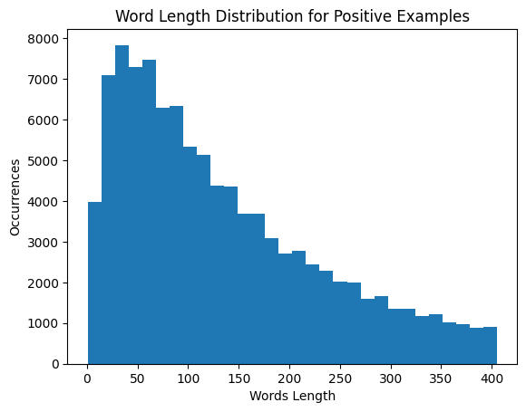
>   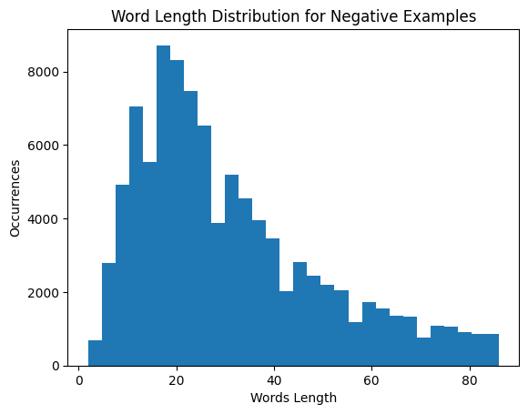
> </p>
>
> While comparing the word length distribution for each post with respect to the negative examples, the positive
> examples have significantly more words per post. Both distributions are skewed to the right.
>
> <p>
>   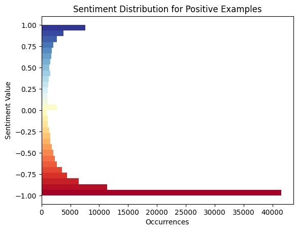
>   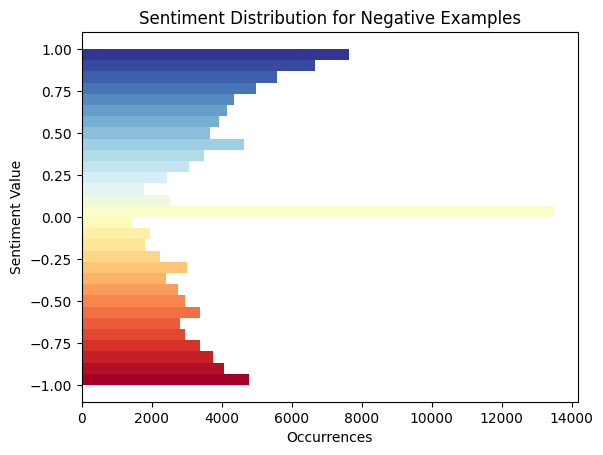
> </p>
>
> The positive examples have an overwhelming ratio of negative sentiment. Note that having negative sentiment does not
> necessarily mean that the text has suicidal thoughts.
>
> <p>
>   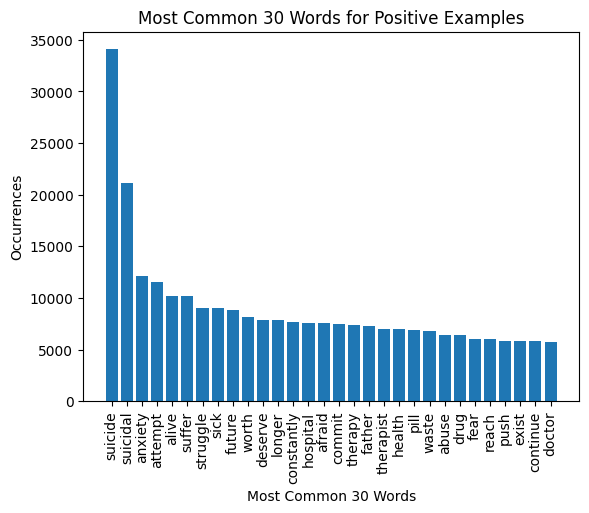
>   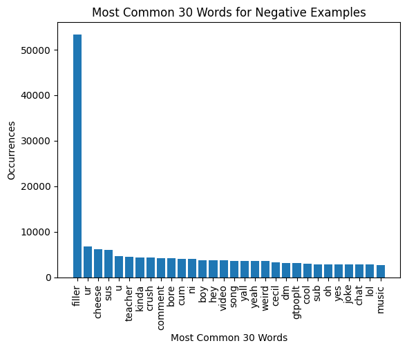
> </p>
>
> Notice that the positive examples have suicide-related words, while the negative examples have miscellaneous words.
>
> <p>
>   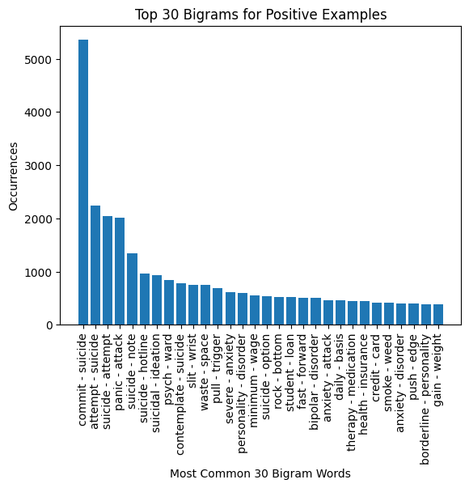
>   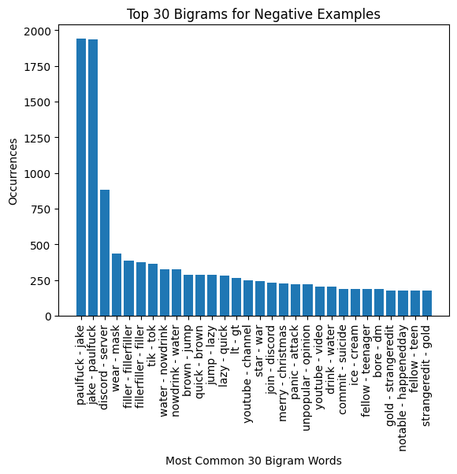
> </p>
>
> The most common bigram in the positive examples is **commit suicide** and **attempt suicide**.
>
> <p>
>   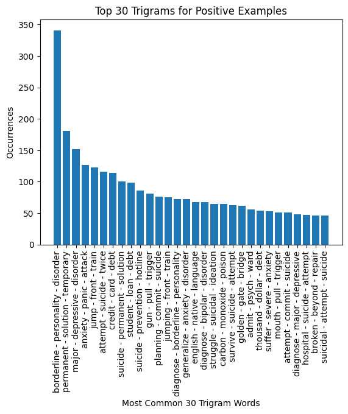
>   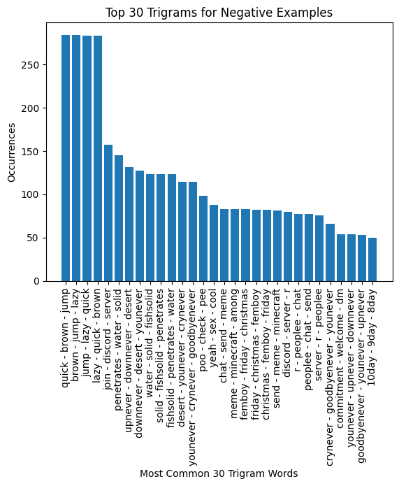
> </p>
>
> The most common trigram in the positive examples is **borderline personality disorder**, which is very common among
> depressed people.
>
> <p>
>   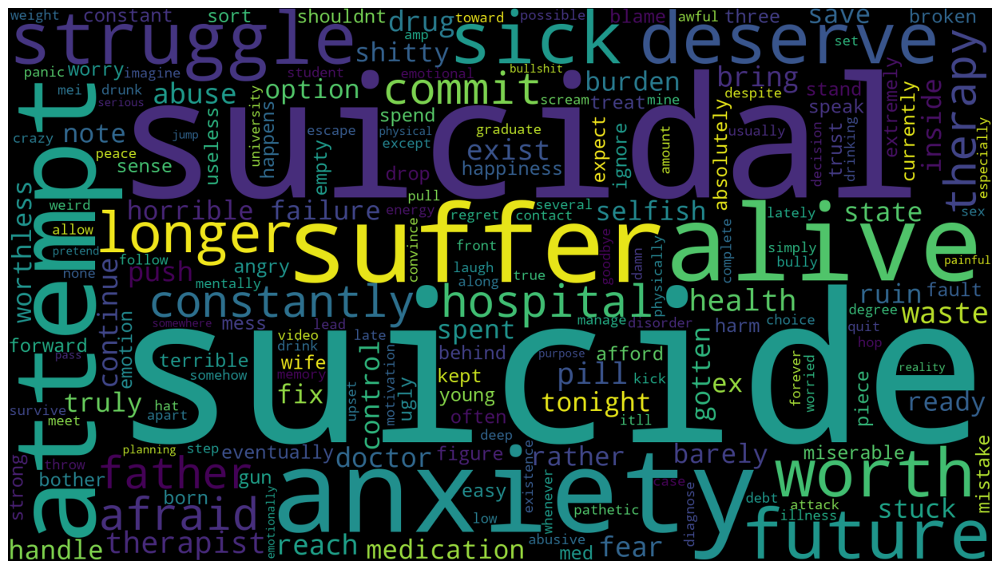
>   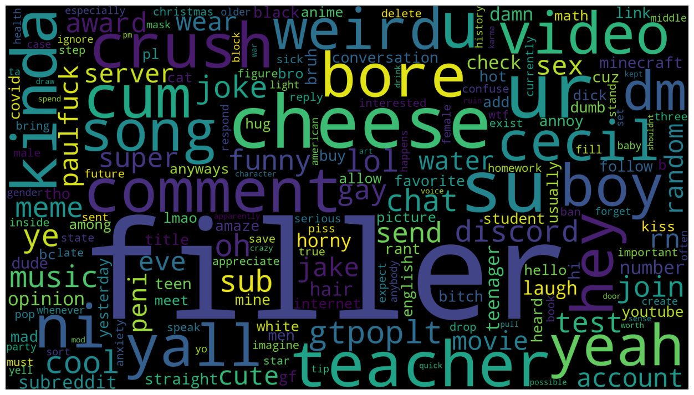
> </p>
>
> Another representation for the top **N** words; where the left figure denotes positive examples, and the right figure
> denotes negative examples.

Model Construction
------------

The `distilbert-base-uncased` pre-trained model has been used, the model weights and architecture can be accessed
[here](https://huggingface.co/distilbert-base-uncased).

`distilbert-base-uncased` is the result of this [paper](https://arxiv.org/abs/1910.01108); the authors have trained
their model based on the same corpus as the original BERT model, which consisted of:

* English Wikipedia
* Toronto Book Corpus

All the layers of the model were trainable (66,955,010 parameters).


Findings
------------

> ### Model Performance
>
> 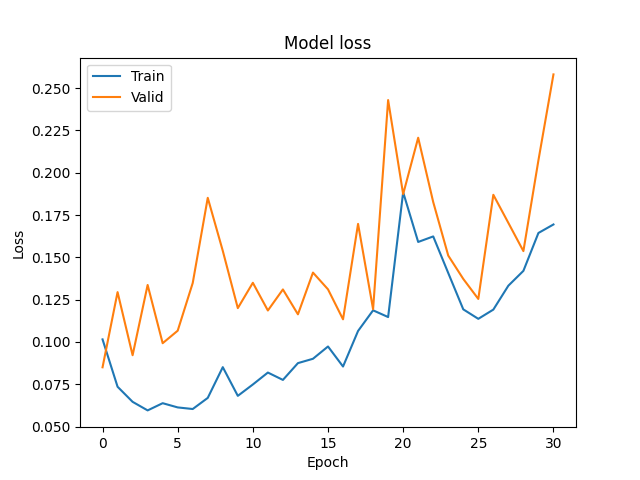
>
> The lowest loss achieved during the training process was at the first epoch (0.0850). Such a result indicates that the
> pre-trained initial weights were near-optimal; or that the hyperparameters should be further tuned.
>
> 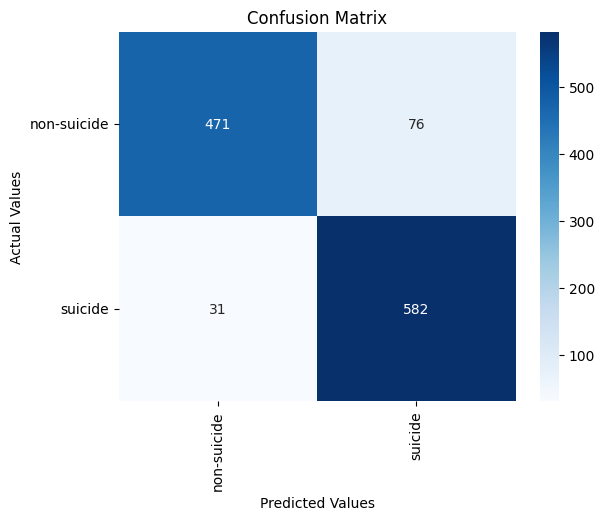
>
> The model has a relatively higher error rate in discriminating texts that are not suicidal but perceived as one.
>
> The testing dataset reported the following evaluation metric results:
> * Accuracy: 90.94%
> * Precision: 86.75%
> * Recall: 96.93%
> * F1 Score: 91.56%

Notes
------------

> **Note**: Due to the computational limitations, we could not drop the weights of the pre-trained model; since by doing
> so, the number of epochs required to converge will significantly increase.

--------
